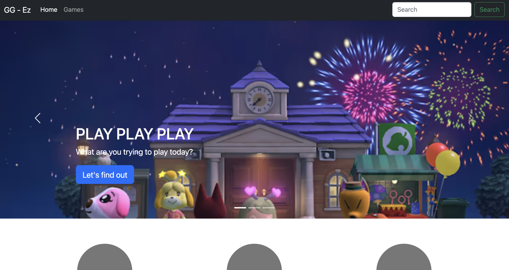
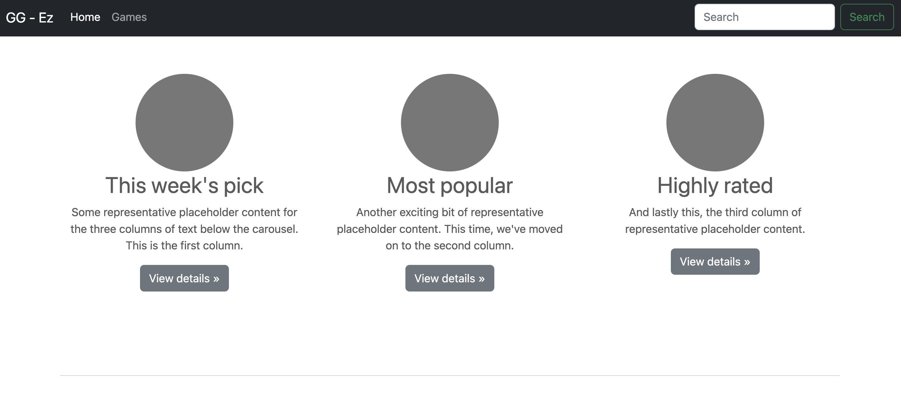
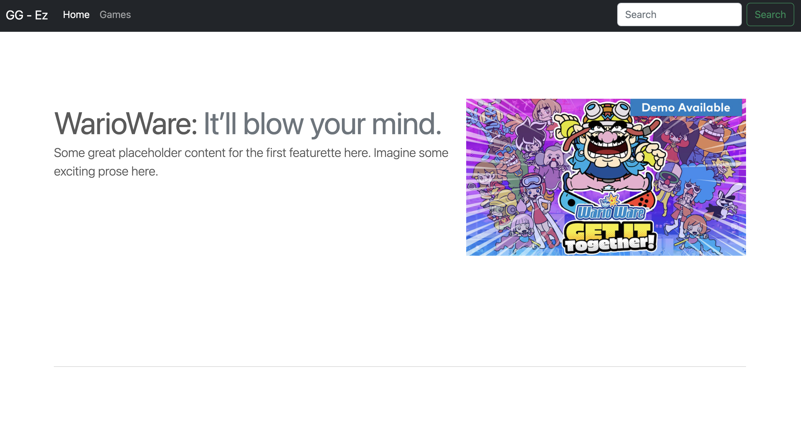
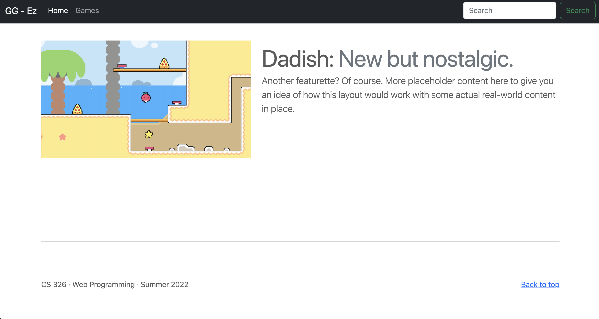

# Milestone #2: User Interface

## Part 1: Data Interactions
"If your idea remains the same as what you submitted for Milestone #1, this will be the same" - idea remains the same, below I copied part of what was submitted for milestone 1:
### Data:
- Game name - i.e. Scrabble, League of Legends, etc.
- Image - game cover if available
- Game type - i.e. Board game, desktop, etc.
- Rating/Reviews - user input
- Genre/Category - i.e. puzzles, shooter, racing, etc.
- Number of players - single, two, multi
- Audience - some indicator of expected audience (E, G, PG, etc.)
- Play time - expected time needed to finish a game

## Part 2: HTML and CSS
Below are screenshots of my current user interface:

